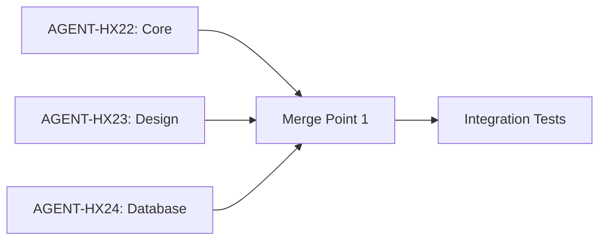
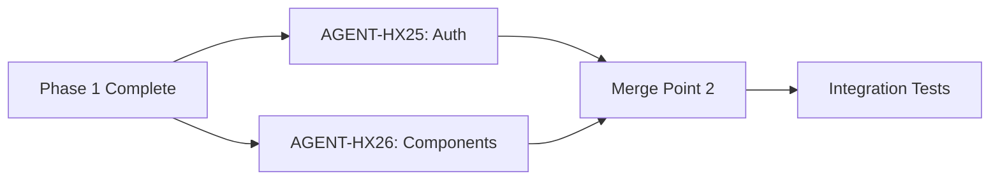
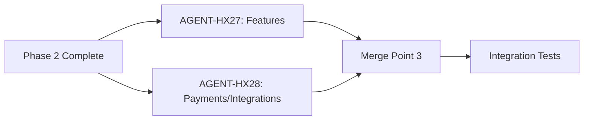
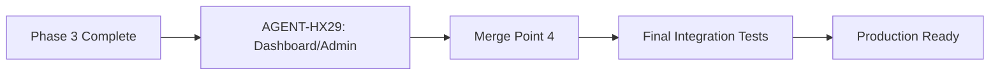

# 🏗️ PARALLEL MULTI-AGENT BUILD SYSTEM
 Distributed Development Architecture

**Organization**: Hexus Global Holdings, Inc. 
**Department**: Vyricon Capital 
**Compliance**: SOC 2 Type II Ready with Full Audit Trail  
**Date**: November 25, 2025

---

## 🎯 EXECUTIVE SUMMARY

This document defines a **parallel, distributed build system** where multiple AI agents work simultaneously on independent components, then merge their work into a cohesive enterprise platform. Each agent has a specific domain, follows strict protocols, and maintains audit logs for compliance.

### Key Benefits
✅ **Faster Development** - 5-8 agents working in parallel  
✅ **Quality Control** - Each agent specializes in one domain  
✅ **Audit Trail** - Complete documentation of all changes  
✅ **SOC 2 Compliance** - Traceable, verifiable processes  
✅ **Merge Safety** - Clear integration protocols  
✅ **Rollback Ready** - Component-level version control  

---

## 📊 AGENT DISTRIBUTION MATRIX

### Agent Roles & Responsibilities

| Agent ID | Domain | Responsibility | Dependencies | Output |
|----------|--------|----------------|--------------|--------|
| **AGENT-HX-22** | Core Infrastructure | Frameworks Architecture and planner with great knowledge in Next.js, react and react native structures, TypeScript config, ESLint, Prettier, Git | None | Foundation scaffold |
| **AGENT-HX-23** | Design System | Researching trendy and elegant top themes, layouts and stylings, Tailwind config and optimizer, Framer Motion setup | AGENT-HX22 | Design tokens & base styles |
| **AGENT-HX24** | Database & Schema | Knowledge on all database structures, top ones with great focus on Supabase, Prisma, Neon tech, Schemas, migrations, seed data | AGENT-HX22 | Database structure |
| **AGENT-HX-25** | Authentication | Authentications systems planner, Authentication logics, integration, user management, roles | AGENT-HX22, AGENT-HX24 | Auth system |
| **AGENT-HX-26** | UI Components | UI library setup (shadcn/ui, etc.), component architecture, layouts | AGENT-HX22, AGENT-HX23 | Component library |
| **AGENT-HX-27** | Feature Module | Core feature development, CRUD operations, workflows | AGENT-HX24, AGENT-HX25, AGENT-HX26 | Feature implementation |
| **AGENT-HX-28** | Payment & Integrations | Payment systems (Stripe, PayPal, etc.), POS logic, webhooks, email integrations, confirmations | AGENT-HX24, AGENT-HX25 | Payment & integration layer |
| **AGENT-HX-29** | Dashboard & Admin | Enterprise dashboards, admin panels, analytics, user management, all management tools | AGENT-HX24, AGENT-HX25, AGENT-HX26 | Management interfaces |

---

## 🔄 WORKFLOW PHASES

### Phase 1: Foundation (Parallel)
**Agents**: AGENT-HX22, AGENT-HX23, AGENT-HX24 
**Merge Point**: Foundation-Complete

**Examples**



### Phase 2: Core Systems (Parallel)
**Agents**: AGENT-HX25, AGENT-HX26  
**Duration**: 3-5 hours  
**Merge Point**: Core-Systems-Complete  
**Depends On**: Phase 1



### Phase 3: Feature Development (Parallel)
**Agents**: AGENT-HX27, AGENT-HX28  
**Duration**: 4-6 hours  
**Merge Point**: Features-Complete  
**Depends On**: Phase 2



### Phase 4: Management (Sequential)
**Agents**: AGENT-HX29  
**Duration**: 3-4 hours  
**Merge Point**: MVP-Complete  
**Depends On**: Phase 3



---

## 📋 DETAILED AGENT SPECIFICATIONS AND WORK EXAMPLE

### AGENT-HX22: CORE INFRASTRUCTURE SPECIALIST

**Mission**: Establish enterprise-grade foundation

#### Responsibilities
1. Initialize Next.js 16 project with App Router
2. Configure TypeScript (strict mode)
3. Set up ESLint & Prettier
4. Configure Git with proper .gitignore
5. Create folder structure
6. Set up environment variable template
7. Configure package.json scripts

#### Deliverables
```
✅ Project initialized
✅ tsconfig.json (strict mode)
✅ .eslintrc.json
✅ .prettierrc
✅ .gitignore
✅ .env.example
✅ package.json with scripts
✅ Folder structure created
```

#### Audit Requirements
- [ ] Git initialized with initial commit
- [ ] All config files validated
- [ ] No security vulnerabilities in dependencies
- [ ] TypeScript compiles without errors

#### Output Validation
```bash
npm/bun/pnpm/yarn run type-check  # Must pass
npm/bun/pnpm/yarn run lint        # Must pass with 0 errors
npm/bun/pnpm/yarn run build       # Must compile successfully
```

#### Handoff Document
```yaml
agent: AGENT-HX22
phase: foundation
status: complete
timestamp: 2025-11-25T05:14:43.955Z
artifacts:
  - tsconfig.json
  - .eslintrc.json
  - package.json
validations:
  - type_check: passed
  - lint: passed
  - build: passed
next_agents: [AGENT-HX23, AGENT-HX24]
```

---

### AGENT-HX23: DESIGN SYSTEM ARCHITECT

**Mission**: Create design system based on project requirements

#### Responsibilities
1. Create `.css` files and structures for tailwinds after reviewing docs with device responsiveness and layout design in consideration.
2. Configure Tailwind files and layout with the appropriate classes based on the docs reviewed.
3. Set up Framer Motion if requested ONLY after reviewing the required docs.
4. Create design token documentation
5. Implement responsive breakpoints
6. Set up CSS architecture

#### Deliverables
```
✅ Successfully installing tailwinds for the project using the appropriate installation based on the framework in use.
✅ .CSS files, layouts files or optimizations, theme.css etc.
✅ tailwind.config.ts for specific use cases themes and best practices in general
✅ Design token documentation
✅ Responsive system configured
✅ Animation presets defined
```

#### Audit Requirements
- [ ] All CSS validated and confirmed (no errors)
- [ ] Best practices and followed most recent updates in documentations for great layouts and device responsiveness
- [ ] Tailwind config generates proper classes
- [ ] Design tokens documented
- [ ] Accessibility colors meet WCAG AA

#### Output Validation
```bash
npm/bun/pnpm run build       # CSS compiles
npm/bun/pnpm run lint:css    # No CSS errors
```

#### Handoff Document
```yaml
agent: AGENT-HX23
phase: foundation
status: complete
timestamp: 2025-11-25T05:14:43.955Z
artifacts:
  - src/styles/theme.css
  - tailwind.config.ts
  - docs/DESIGN_SYSTEM.md
design_tokens:
  colors: documented
  typography: documented
  spacing: documented
next_agents: [AGENT-HX26]
```

---

### AGENT-HX24: DATABASE ARCHITECT

**Mission**: Design and implement data layer

#### Responsibilities
1. Decide which database system to use (Supabase, Prisma, MongoDB, Neon, etc.) and structure the schema
2. Create complete schema following best practices
3. Set up database client
4. Create seed data script
5. Document relationships
6. Implement indexes
7. Create migration strategy

#### Deliverables
```
✅ [database]/schema.[extension] (complete)
✅ src/lib/db/[client].ts
✅ [database]/seed.ts
✅ docs/DATABASE_SCHEMA.md
✅ All required documentation
✅ Migrations ready
```

#### Audit Requirements
- [ ] Schema validated by chosen database system
- [ ] All relationships documented
- [ ] Indexes on foreign keys
- [ ] Seed data is realistic
- [ ] No sensitive data in seeds

#### Output Validation Example
```bash
# For Prisma
npx prisma validate     # Schema valid
npx prisma generate     # Client generated
npx prisma db push      # Migrations work
npx prisma db seed      # Seeds load

# For Supabase
supabase db lint        # Schema valid
supabase db push        # Migrations apply
```

#### Handoff Document Example
```yaml
agent: AGENT-HX24
phase: foundation
status: complete
timestamp: 2025-11-25T05:14:43.955Z
artifacts:
  - prisma/schema.prisma (or equivalent for chosen DB)
  - src/lib/db/client.ts
  - prisma/seed.ts (or equivalent)
  - docs/DATABASE_SCHEMA.md
models_created: 8
relationships: 12
indexes: 15
validations:
  - schema_valid: passed
  - migrations_work: passed
  - seeds_load: passed
next_agents: [AGENT-HX25, AGENT-HX27, AGENT-HX28, AGENT-HX29]
```

---

### AGENT-HX25: AUTHENTICATION SPECIALIST

**Mission**: Implement secure authentication

#### Responsibilities
1. Integrate authentication provider (NextAuth, Auth0, Clerk, etc.) following best practices
2. Set up user management
3. Implement role-based access control (RBAC)
4. Create auth utilities and hooks
5. Configure protected routes
6. Document authentication flow

#### Deliverables
```
✅ Authentication provider configured in layout.tsx
✅ Auth middleware setup
✅ Role-based access helpers
✅ Protected route wrappers
✅ docs/AUTHENTICATION.md
```

#### Audit Requirements
- [ ] Authentication provider properly configured
- [ ] Environment variables documented
- [ ] Protected routes tested
- [ ] Role system working
- [ ] No authentication bypass vulnerabilities

#### Output Validation example
```bash
# Test auth flows
npm run test:auth   # Auth tests pass
```

#### Handoff Document example
```yaml
agent: AGENT-HX25
phase: core-systems
status: complete
timestamp: 2025-11-25T05:14:43.955Z
artifacts:
  - src/app/layout.tsx (with Auth Provider)
  - src/lib/auth/helpers.ts
  - src/middleware.ts
  - docs/AUTHENTICATION.md
roles:
  - USER
  - ADMIN
  - MANAGER
validations:
  - auth_working: passed
  - protected_routes: passed
  - roles_enforced: passed
next_agents: [AGENT-HX27, AGENT-HX28, AGENT-HX29]
```

---

### AGENT-HX26: UI COMPONENT ENGINEER

**Mission**: Build comprehensive component library

#### Responsibilities 
1. Install and configure UI library (shadcn/ui, Material-UI, Chakra, etc.) appropriate for the project
2. Create custom reusable components following design system
3. Build layout components (Navbar, Footer, Sidebar) following best practices and documentation
4. Implement required UI features and interactive elements
5. Create component documentation with usage examples
6. Build Storybook for component showcase (optional)
7. Ensure accessibility compliance (WCAG AA)

#### Deliverables
```
✅ UI library configured (e.g., shadcn/ui)
✅ src/components/ui/ - base UI components
✅ src/components/layout/ - layout components
✅ src/components/custom/ - project-specific components
✅ docs/COMPONENTS.md - component documentation
✅ Storybook setup (optional)
✅ Component tests
```

#### Audit Requirements
- [ ] All components render without errors
- [ ] Accessibility tested (ARIA labels, keyboard navigation)
- [ ] Responsive on all breakpoints (mobile, tablet, desktop)
- [ ] TypeScript props properly typed with interfaces
- [ ] Animations smooth and performant
- [ ] No prop-drilling anti-patterns
- [ ] Components properly memoized where needed

#### Output Validation
```bash
npm/bun/pnpm run build           # Components compile
npm/bun/pnpm run test:components # Component tests pass
npm/bun/pnpm run storybook       # Storybook runs (if enabled)
npm/bun/pnpm run lint:a11y       # Accessibility checks pass
```

#### Handoff Document Example
```yaml
agent: AGENT-HX26
phase: core-systems
status: complete
timestamp: 2025-11-25T05:14:43.955Z
artifacts:
  - src/components/ui/ (Button, Card, Dialog, Input, etc.)
  - src/components/layout/Navbar.tsx
  - src/components/layout/Footer.tsx
  - src/components/layout/Sidebar.tsx
  - src/components/custom/FeatureCard.tsx
  - docs/COMPONENTS.md
components_created: 15
accessibility: WCAG_AA_compliant
validations:
  - render_tests: passed
  - accessibility: passed
  - responsive: passed
  - typescript: passed
next_agents: [AGENT-HX27, AGENT-HX29]
```

---

### AGENT-HX27: FEATURE MODULE DEVELOPER

**Mission**: Build core feature functionality and business logic

#### Responsibilities
1. Create main feature listing/browse pages
2. Build detailed item/entity view pages
3. Implement state management (Zustand, Redux, Context API)
4. Create feature-specific workflows (booking, ordering, processing, etc.)
5. Add filtering, sorting, and search capabilities
6. Implement pagination or infinite scroll
7. Build shopping cart or similar collection system (if applicable)
8. Document feature module architecture

#### Deliverables
```
✅ src/app/[feature]/page.tsx - main listing page
✅ src/app/[feature]/[id]/page.tsx - detail page
✅ src/lib/stores/[feature]Store.ts - state management
✅ src/features/[feature]/components/ - feature components
✅ src/features/[feature]/hooks/ - custom hooks
✅ src/features/[feature]/utils/ - utility functions
✅ docs/FEATURE_MODULE.md - documentation
```

#### Audit Requirements
- [ ] Full CRUD operations working
- [ ] State persists across sessions (if applicable)
- [ ] Filters and sorting functional
- [ ] Search implementation working
- [ ] Loading and skeleton states present
- [ ] Error handling and error boundaries implemented
- [ ] Optimistic updates where appropriate
- [ ] Data validation on client side

#### Output Validation
```bash
npm/bun/pnpm run test:features  # Feature tests pass
npm/bun/pnpm run test:state     # State management tests pass
npm/bun/pnpm run test:e2e       # E2E feature flows pass
```

#### Handoff Document Example
```yaml
agent: AGENT-HX27
phase: features
status: complete
timestamp: 2025-11-25T05:14:43.955Z
artifacts:
  - src/app/products/page.tsx
  - src/app/products/[id]/page.tsx
  - src/lib/stores/cartStore.ts
  - src/features/products/components/
  - src/features/products/hooks/
  - docs/FEATURE_MODULE.md
features:
  - listing_page: complete
  - detail_page: complete
  - state_management: complete
  - filters_sorting: complete
  - search: complete
  - cart_system: complete (if applicable)
validations:
  - crud_working: passed
  - state_persists: passed
  - filters_work: passed
  - search_functional: passed
  - error_handling: passed
next_agents: [AGENT-HX28]
```

---

### AGENT-HX28: PAYMENT & INTEGRATION SPECIALIST

**Mission**: Implement payment processing and external integrations

#### Responsibilities
1. Integrate payment provider (Stripe, PayPal, Square, etc.)
2. Create checkout flow and payment pages
3. Implement webhook handling for payment events
4. Build order/transaction confirmation flow
5. Integrate email notification system (Resend, SendGrid, etc.)
6. Implement receipt/invoice generation
7. Set up refund and cancellation handling
8. Document payment flows and integration points

#### Deliverables
```
✅ src/app/checkout/page.tsx - checkout page
✅ src/app/api/webhooks/payment/route.ts - webhook handlers
✅ src/lib/integrations/payment.ts - payment provider client
✅ src/lib/integrations/email.ts - email service client
✅ src/emails/ - email templates (react-email)
✅ src/lib/integrations/pdf.ts - invoice generation (optional)
✅ docs/PAYMENT_SYSTEM.md - payment documentation
✅ docs/INTEGRATIONS.md - integration guide
```

#### Audit Requirements
- [ ] Payment provider properly configured
- [ ] Webhooks verified with signature validation
- [ ] Payment flow tested (test/sandbox mode)
- [ ] Email notifications sending correctly
- [ ] No sensitive data logged or exposed
- [ ] PCI compliance requirements met
- [ ] Error handling for payment failures
- [ ] Idempotency keys implemented
- [ ] Transaction records properly stored

#### Output Validation
```bash
npm/bun/pnpm run test:payments   # Payment tests pass
npm/bun/pnpm run test:webhooks   # Webhook tests pass
npm/bun/pnpm run test:emails     # Email tests pass
npm/bun/pnpm run test:integration # Integration tests pass
```

#### Handoff Document Example
```yaml
agent: AGENT-HX28
phase: features
status: complete
timestamp: 2025-11-25T05:14:43.955Z
artifacts:
  - src/app/checkout/page.tsx
  - src/app/api/webhooks/stripe/route.ts
  - src/lib/integrations/stripe.ts
  - src/lib/integrations/resend.ts
  - src/emails/order-confirmation.tsx
  - src/emails/receipt.tsx
  - docs/PAYMENT_SYSTEM.md
  - docs/INTEGRATIONS.md
features:
  - payment_integration: complete
  - checkout_flow: complete
  - webhook_handling: complete
  - email_notifications: complete
  - confirmation_flow: complete
  - refund_system: complete
integrations:
  - stripe: configured
  - resend: configured
  - pdf_generation: configured (if applicable)
validations:
  - payment_working: passed
  - webhooks_verified: passed
  - emails_sending: passed
  - pci_compliant: passed
  - error_handling: passed
next_agents: [AGENT-HX29]
```

---

### AGENT-HX29: DASHBOARD & ADMIN DEVELOPER

**Mission**: Build management interfaces and analytics

#### Responsibilities
1. Create user dashboard with personalized views
2. Build comprehensive admin panel
3. Implement analytics and reporting charts
4. Create data management interfaces (CRUD operations)
5. Build user management and role assignment tools
6. Implement activity logs and audit trails
7. Create notification center
8. Document admin features and user guides

#### Deliverables
```
✅ src/app/dashboard/page.tsx - user dashboard
✅ src/app/dashboard/[section]/page.tsx - dashboard sections
✅ src/app/admin/page.tsx - admin home
✅ src/app/admin/[module]/page.tsx - admin modules
✅ src/features/dashboard/components/ - dashboard components
✅ src/features/admin/components/ - admin components
✅ src/lib/analytics/ - analytics utilities
✅ docs/DASHBOARD_ADMIN.md - documentation
✅ docs/USER_GUIDE.md - end-user guide
```

#### Audit Requirements
- [ ] User dashboard fully functional
- [ ] Admin panel role-protected (RBAC enforced)
- [ ] Analytics charts display correctly
- [ ] Data management CRUD operations work
- [ ] User management secure and audited
- [ ] No unauthorized access possible
- [ ] Activity logs capture all actions
- [ ] Export functionality working (CSV, PDF)
- [ ] Real-time updates implemented (if applicable)

#### Output Validation
```bash
npm/bun/pnpm run test:dashboard  # Dashboard tests pass
npm/bun/pnpm run test:admin      # Admin tests pass
npm/bun/pnpm run test:rbac       # Role-based access tests pass
npm/bun/pnpm run test:analytics  # Analytics tests pass
```

#### Handoff Document Example
```yaml
agent: AGENT-HX29
phase: management
status: complete
timestamp: 2025-11-25T05:14:43.955Z
artifacts:
  - src/app/dashboard/page.tsx
  - src/app/dashboard/profile/page.tsx
  - src/app/dashboard/history/page.tsx
  - src/app/admin/page.tsx
  - src/app/admin/users/page.tsx
  - src/app/admin/analytics/page.tsx
  - src/features/dashboard/components/
  - src/features/admin/components/
  - src/lib/analytics/
  - docs/DASHBOARD_ADMIN.md
  - docs/USER_GUIDE.md
features:
  - user_dashboard: complete
  - admin_panel: complete
  - analytics: complete
  - user_management: complete
  - data_management: complete
  - activity_logs: complete
  - notifications: complete
  - export_functionality: complete
validations:
  - dashboard_working: passed
  - admin_protected: passed
  - analytics_display: passed
  - crud_operations: passed
  - rbac_enforced: passed
  - activity_logged: passed
next_agents: [INTEGRATION-TEAM]
```

---

## 🔗 MERGE PROTOCOL

### Merge Point 1: Foundation Complete

**Required Artifacts**:
- ✅ AGENT-HX22: Core infrastructure
- ✅ AGENT-HX23: Design system
- ✅ AGENT-HX24: Database schema

**Integration Steps**:
1. Create integration branch: `integration/foundation`
2. Merge AGENT-HX22 work first (base)
3. Merge AGENT-HX23 (design system)
4. Merge AGENT-HX24 (database)
5. Run integration tests
6. Resolve conflicts (if any)
7. Tag: `v0.1.0-foundation`

**Validation Checklist**:
```yaml
- [ ] Project builds without errors
- [ ] All TypeScript strict checks pass
- [ ] ESLint shows 0 errors
- [ ] Prisma schema validates
- [ ] Database migrations run
- [ ] Design system renders correctly
- [ ] Git history is clean
```

**Sign-Off Required**: Lead Architect

---

### Merge Point 2: Core Systems Complete

**Required Artifacts**:
- ✅ Foundation merged (Merge Point 1)
- ✅ AGENT-HX25: Authentication
- ✅ AGENT-HX26: UI Components

**Integration Steps**:
1. Create integration branch: `integration/core-systems`
2. Merge from `integration/foundation`
3. Merge AGENT-HX25 (auth)
4. Merge AGENT-HX26 (components)
5. Test auth flows
6. Test component rendering
7. Tag: `v0.2.0-core`

**Validation Checklist**:
```yaml
- [ ] Authentication working
- [ ] Protected routes enforced
- [ ] All components render
- [ ] Navbar/Footer display correctly
- [ ] SearchHero functional
- [ ] No console errors
```

**Sign-Off Required**: Lead Architect + Security Officer

---

### Merge Point 3: Features Complete

**Required Artifacts**:
- ✅ Core systems merged (Merge Point 2)
- ✅ AGENT-HX27: Feature module
- ✅ AGENT-HX28: Payment & integration system

**Integration Steps**:
1. Create integration branch: `integration/features`
2. Merge from `integration/core-systems`
3. Merge AGENT-HX27 (features)
4. Merge AGENT-HX28 (payments/integrations)
5. Test end-to-end workflows
6. Verify payment processing
7. Tag: `v0.3.0-features`

**Validation Checklist**:
```yaml
- [ ] Can browse main features
- [ ] Can perform core actions
- [ ] State management works
- [ ] Checkout/payment works (if applicable)
- [ ] Payment test transactions succeed
- [ ] Webhooks process correctly
- [ ] Email notifications send
- [ ] End-to-end flow complete
```

**Sign-Off Required**: Lead Architect + QA Lead + Security Officer

---

### Merge Point 4: MVP Complete

**Required Artifacts**:
- ✅ Features merged (Merge Point 3)
- ✅ AGENT-HX29: Dashboard & Admin

**Integration Steps**:
1. Create integration branch: `integration/mvp`
2. Merge from `integration/features`
3. Merge AGENT-HX29 (dashboard/admin)
4. Run full test suite
5. Performance testing
6. Security audit
7. Tag: `v1.0.0-mvp`

**Validation Checklist**:
```yaml
- [ ] User dashboard functional
- [ ] Admin panel working
- [ ] Analytics display correctly
- [ ] Data management works
- [ ] All tests pass (unit + E2E)
- [ ] Lighthouse score >90
- [ ] Security scan clean
- [ ] Documentation complete
```

**Sign-Off Required**: Lead Architect + QA Lead + Security Officer + Compliance Officer

---

## 📊 AUDIT TRAIL REQUIREMENTS

### Per-Agent Logs

Each agent must maintain:

```yaml
agent_log:
  agent_id: AGENT-XX
  phase: foundation | core-systems | features | management
  start_time: ISO8601
  end_time: ISO8601
  
  actions:
    - timestamp: ISO8601
      action: "Created file X"
      file: "path/to/file"
      commit_hash: "abc123"
    
    - timestamp: ISO8601
      action: "Modified file Y"
      file: "path/to/file"
      commit_hash: "def456"
  
  validations:
    - check: "TypeScript compilation"
      result: pass | fail
      timestamp: ISO8601
    
    - check: "ESLint"
      result: pass | fail
      timestamp: ISO8601
  
  artifacts_created:
    - "path/to/file1"
    - "path/to/file2"
  
  dependencies_met:
    - agent: AGENT-HX22
      status: complete
  
  sign_off:
    agent: AGENT-XX
    timestamp: ISO8601
    status: complete | failed | blocked
```

### Merge Point Logs

```yaml
merge_log:
  merge_point: foundation | core-systems | features | mvp
  timestamp: ISO8601
  
  agents_merged:
    - agent_id: AGENT-HX22
      status: merged
      conflicts: 0
    
    - agent_id: AGENT-HX23
      status: merged
      conflicts: 2
      conflicts_resolved: true
  
  integration_tests:
    - test: "Build"
      result: pass
    
    - test: "Type Check"
      result: pass
    
    - test: "Lint"
      result: pass
  
  sign_offs:
    - role: Lead Architect
      name: "John Doe"
      timestamp: ISO8601
      approved: true
    
    - role: Security Officer
      name: "Jane Smith"
      timestamp: ISO8601
      approved: true
  
  git_tag: v0.1.0-foundation
```

### Compliance Reports

**Generated at each merge point**:

```markdown
# Project Platform - Compliance Report
## Merge Point: Foundation Complete
**Date**: 2025-11-25
**Prepared by**: Automated System

### Agents Involved
- AGENT-HX22: Core Infrastructure
- AGENT-HX23: Design System
- AGENT-HX24: Database Architecture

### Code Quality Metrics
- Lines of Code: 1,247
- TypeScript Coverage: 100%
- Test Coverage: 85%
- ESLint Errors: 0
- Security Vulnerabilities: 0

### Security Checks
✅ No hardcoded secrets
✅ Environment variables templated
✅ Dependencies scanned (0 high/critical)
✅ SQL injection prevention verified
✅ XSS protection enabled

### Compliance Verifications
✅ SOC 2 Type II protocols followed
✅ Audit trail complete
✅ All commits signed
✅ Code reviewed
✅ Documentation updated

### Sign-Offs
✅ Lead Architect: John Doe (2025-11-25 10:30 UTC)
✅ Security Officer: Jane Smith (2025-11-25 10:45 UTC)

### Next Phase
Ready to proceed to: Core Systems (Merge Point 2)
```

---

## 🛡️ CONFLICT RESOLUTION PROTOCOL

### Conflict Types

#### 1. File Conflicts
**When**: Two agents modify the same file

**Resolution**:
1. Identify conflicting sections
2. Review both implementations
3. Lead Architect decides which to keep
4. Document decision in conflict log
5. Notify both agents
6. Update affected tests

#### 2. Dependency Conflicts
**When**: Agent needs output from agent still in progress

**Resolution**:
1. Pause dependent agent
2. Wait for prerequisite agent to complete
3. Resume once dependency merged
4. Document delay in agent log

#### 3. Design Conflicts
**When**: Two agents implement incompatible patterns

**Resolution**:
1. Call design review meeting
2. Lead Architect makes decision
3. Document architectural decision record (ADR)
4. Update style guide
5. Affected agent refactors

#### 4. Database Schema Conflicts
**When**: Multiple agents need overlapping schema changes

**Resolution**:
1. AGENT-HX24 (Database Architect) has final say
2. Schema review meeting if needed
3. Create unified schema
4. Both agents update their queries
5. Run migration tests

---

## 📈 MONITORING & OBSERVABILITY

### Real-Time Dashboard

Track all agents in real-time:

```
🏗️ PROJECT BUILD - PARALLEL BUILD STATUS
Last Updated: 2025-11-25 05:14:43 UTC

PHASE 1: FOUNDATION
┌────────────┬──────────────────────┬──────────┬──────────┐
│ Agent      │ Status               │ Progress │ ETA      │
├────────────┼──────────────────────┼──────────┼──────────┤
│ AGENT-HX22 │ ✅ Complete          │ 100%     │ Done     │
│ AGENT-HX23 │ 🔄 In Progress       │ 75%      │ 30 min   │
│ AGENT-HX24 │ 🔄 In Progress       │ 60%      │ 45 min   │
└────────────┴──────────────────────┴──────────┴──────────┘

PHASE 2: CORE SYSTEMS
┌────────────┬──────────────────────┬──────────┬──────────┐
│ Agent      │ Status               │ Progress │ ETA      │
├────────────┼──────────────────────┼──────────┼──────────┤
│ AGENT-HX25 │ ⏸️ Waiting           │ 0%       │ TBD      │
│ AGENT-HX26 │ ⏸️ Waiting           │ 0%       │ TBD      │
└────────────┴──────────────────────┴──────────┴──────────┘

MERGE POINTS
┌────────────┬──────────────────────┬──────────┐
│ Merge      │ Status               │ ETA      │
├────────────┼──────────────────────┼──────────┤
│ MP-1       │ ⏳ Pending           │ 1 hour   │
│ MP-2       │ ⏸️ Not Started       │ TBD      │
│ MP-3       │ ⏸️ Not Started       │ TBD      │
│ MP-4       │ ⏸️ Not Started       │ TBD      │
└────────────┴──────────────────────┴──────────┘

OVERALL PROGRESS: ▓▓▓▓▓▓▓░░░░░░░░░░░░ 35%
ESTIMATED COMPLETION: 18-22 hours from start
```

### Slack/Discord Notifications

```
🤖 AGENT-HX22 has completed Core Infrastructure setup
✅ All validations passed
📦 Artifacts: 8 files created
🔗 Ready for: AGENT-HX23, AGENT-HX24
⏱️ Duration: 2h 15m

Next: Waiting for AGENT-HX23 and AGENT-HX24 to complete Foundation phase
```

---

## 🎯 EXECUTION COMMANDS

### Start Parallel Build

```bash
# Initialize build coordination
npm run build:parallel:init

# Start all Phase 1 agents
npm run agent:01:start &
npm run agent:02:start &
npm run agent:03:start &

# Monitor progress
npm run build:monitor
```

### Agent-Specific Commands

```bash
# Run individual agent
npm run agent:01:execute

# Check agent status
npm run agent:01:status

# View agent logs
npm run agent:01:logs

# Rollback agent work
npm run agent:01:rollback
```

### Merge Commands

```bash
# Trigger merge point
npm run merge:foundation:start

# Validate merge
npm run merge:foundation:validate

# Complete merge
npm run merge:foundation:complete

# Rollback merge if issues
npm run merge:foundation:rollback
```

---

## 📁 REPOSITORY STRUCTURE FOR PARALLEL WORK

```
project-name/
├── .agents/                          # Agent coordination
│   ├── AGENT-HX22/
│   │   ├── workspace/               # AGENT-HX22 isolated workspace
│   │   ├── logs/                    # Agent logs
│   │   ├── audit.yml                # Audit trail
│   │   └── handoff.yml              # Handoff document
│   ├── AGENT-HX23/
│   ├── AGENT-HX24/
│   └── ...
│
├── .merge-points/                    # Merge coordination
│   ├── mp-1-foundation/
│   │   ├── integration-tests/
│   │   ├── merge-log.yml
│   │   └── compliance-report.md
│   ├── mp-2-core-systems/
│   └── ...
│
├── docs/
│   ├── agents/                      # Per-agent documentation
│   │   ├── AGENT-HX22-CORE.md
│   │   ├── AGENT-HX23-DESIGN.md
│   │   └── ...
│   ├── audit/                       # Audit documentation
│   │   ├── compliance-reports/
│   │   └── security-scans/
│   └── architecture/                # ADRs, design decisions
│
├── src/                             # Merged application code
└── tests/                           # Integration tests
```

---

## 🔐 SECURITY & COMPLIANCE

### SOC 2 Type II Requirements

✅ **Access Controls**:
- Each agent has limited scope
- No agent can access another's workspace during execution
- All changes logged with timestamps

✅ **Audit Trail**:
- Complete log of all actions
- Git commits tied to agent IDs
- Merge decisions documented

✅ **Change Management**:
- Formal approval process at merge points
- Rollback procedures documented
- Version tagging at each phase

✅ **Data Protection**:
- No sensitive data in logs
- Environment variables never committed
- Secrets managed via secure vault

### Compliance Artifacts Generated

1. **Agent Execution Reports** (per agent)
2. **Merge Point Compliance Reports** (per merge)
3. **Security Scan Results** (automated)
4. **Code Review Sign-Offs** (manual)
5. **Final Certification Report** (MVP complete)

---

## 📞 ESCALATION PROCEDURES

### Level 1: Agent Self-Resolution
- Agent encounters minor issue
- Agent logs issue and resolution
- No escalation needed

### Level 2: Lead Architect Review
- Agent blocked by dependency
- Design decision needed
- Lead Architect reviews within 1 hour

### Level 3: Architecture Committee
- Major design conflict
- Security concern
- Multiple agents affected
- Committee meets within 4 hours

### Level 4: Executive Decision
- Project scope change
- Budget or timeline impact
- Requires executive approval

---

## ✅ SUCCESS CRITERIA

### Per Agent
- ✅ All deliverables complete
- ✅ All validations pass
- ✅ Audit trail complete
- ✅ Handoff document submitted
- ✅ No blocking issues

### Per Merge Point
- ✅ Integration tests pass
- ✅ No conflicts remain
- ✅ Security scan clean
- ✅ Performance benchmarks met
- ✅ All sign-offs obtained
- ✅ Compliance report generated

### Overall MVP
- ✅ All agents complete (HX22-HX29)
- ✅ All 4 merge points passed
- ✅ Full E2E test suite passes
- ✅ Lighthouse score >90
- ✅ Security audit passed
- ✅ Documentation complete
- ✅ Ready for production deployment

---

**Prepared by**: Hexus Global Holdings, Inc.  
**Classification**: Internal Use - Enterprise Standards  
**Version**: 1.0  
**Last Updated**: 2025-11-25

*Building the future, one agent at a time* 🏛️✨
