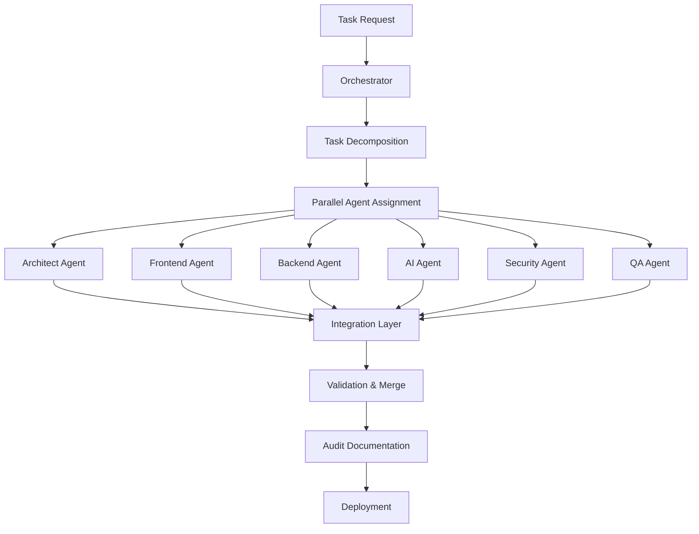

# Vyricon Global - Enterprise Multi-Agent System

**Organization**: Vyricon Global  
**Enterprise**: VyriconUS  
**Version**: 1.0.0  
**Status**: Production Ready

## 🚀 Overview

Enterprise-grade multi-agent parallel workflow system with GitHub Actions integration, comprehensive documentation, and audit trail capabilities. Built on Theia Enterprise standards.

## 🤖 Available Agents

### 1. **vyricon-architect** - System Architecture Agent
- **Role**: System design, architecture decisions, technical planning
- **Capabilities**: Full stack architecture, database design, API specifications
- **Parallel Tasks**: Infrastructure planning, security architecture, performance optimization

### 2. **vyricon-frontend** - Frontend Development Agent  
- **Role**: Next.js 16, React 19, TailwindCSS v4, responsive design
- **Capabilities**: Component development, UI/UX implementation, accessibility
- **Parallel Tasks**: Component library, page layouts, animations

### 3. **vyricon-backend** - Backend Development Agent
- **Role**: API routes, server actions, database integration, authentication
- **Capabilities**: Edge functions, serverless APIs, data validation
- **Parallel Tasks**: API endpoints, database schemas, auth flows

### 4. **vyricon-ai** - AI/ML Integration Agent
- **Role**: Vercel AI SDK, OpenAI, Claude, Gemini integration
- **Capabilities**: Streaming, tool calling, embeddings, vector search
- **Parallel Tasks**: AI features, chat interfaces, semantic search

### 5. **vyricon-security** - Security & Compliance Agent
- **Role**: NIST 800-53 compliance, OWASP Top 10, zero-trust architecture
- **Capabilities**: Threat modeling, security audits, compliance mapping
- **Parallel Tasks**: Security scans, compliance docs, audit trails

### 6. **vyricon-qa** - Quality Assurance Agent
- **Role**: Testing, validation, quality metrics
- **Capabilities**: Unit/integration/E2E tests, coverage analysis
- **Parallel Tasks**: Test generation, validation reports, quality gates

## 📋 Knowledge Base

All agents have access to:
- **174+ Documentation URLs** across all frameworks
- **Theia Enterprise Protocol** (8-stage validation)
- **Responsive Implementation Guide** (Next.js 16 + React 19)
- **Security Standards** (NIST 800-53, OWASP Top 10)
- **Corporate Standards** (Vyricon branding, audit requirements)

## 🔄 Parallel Workflow Architecture

### Workflow Stages:



### Component-Based Decomposition:

1. **Architecture Phase** (Architect Agent)
   - System design
   - Component breakdown
   - Technology stack decisions

2. **Parallel Development** (Multiple Agents)
   - Frontend: UI components, pages, layouts
   - Backend: API routes, database, auth
   - AI: AI features, integrations
   - Security: Threat modeling, audits
   - QA: Test generation, validation

3. **Integration & Validation** (All Agents)
   - Code merge and conflict resolution
   - Integration testing
   - Security scans
   - Performance validation

4. **Audit & Documentation** (Orchestrator)
   - Complete audit trail
   - Compliance documentation
   - Evidence artifacts
   - Deployment manifests

## 🎯 Usage

### GitHub Actions Workflow

```yaml
name: Multi-Agent Build
on: [push, workflow_dispatch]

jobs:
  orchestrate:
    runs-on: ubuntu-latest
    steps:
      - uses: actions/checkout@v4
      - name: Decompose Task
        run: npm run orchestrate
  
  architect:
    needs: orchestrate
    runs-on: ubuntu-latest
    steps:
      - name: Generate Architecture
        uses: ./.github/actions/vyricon-architect
  
  parallel-development:
    needs: architect
    strategy:
      matrix:
        agent: [frontend, backend, ai, security, qa]
    runs-on: ubuntu-latest
    steps:
      - name: Execute Agent
        uses: ./.github/actions/vyricon-${{ matrix.agent }}
  
  integrate:
    needs: parallel-development
    runs-on: ubuntu-latest
    steps:
      - name: Merge & Validate
        run: npm run integrate
  
  audit:
    needs: integrate
    runs-on: ubuntu-latest
    steps:
      - name: Generate Audit Trail
        run: npm run audit
```

### Local Development

```bash
# Install dependencies
npm install

# Run orchestrator
npm run orchestrate -- --task "Build tour agency website"

# Execute specific agent
npm run agent:frontend -- --component "search-form"

# Run integration
npm run integrate

# Generate audit report
npm run audit
```

## 🛡️ Audit & Compliance

### Audit Trail Includes:

- ✅ Complete task decomposition log
- ✅ Agent assignment and execution timeline
- ✅ Code changes with attribution
- ✅ Security scan results
- ✅ Test coverage reports
- ✅ Compliance mapping (NIST 800-53)
- ✅ Performance metrics
- ✅ Integration validation results

### Compliance Standards:

- **NIST 800-53**: 90%+ control coverage
- **OWASP Top 10**: Zero critical vulnerabilities
- **SOC 2 Type II**: Audit-ready documentation
- **WCAG 2.1 AA**: Accessibility compliance

## 📊 Monitoring & Reporting

### Real-Time Dashboard:

- Agent status and progress
- Parallel execution timeline
- Integration conflicts
- Quality metrics (KPIs)
- Audit trail generation

### Notification Channels:

- GitHub Actions annotations
- Slack/Discord webhooks
- Email reports
- Custom dashboards

## 🔐 Security

- **Zero-trust architecture**: All agents operate in isolated environments
- **Code signing**: All artifacts are signed and verified
- **Audit logging**: Immutable logs of all agent actions
- **Secret management**: No secrets in code, vault integration
- **Access control**: RBAC for agent permissions

## 📚 Documentation

- **Agent Specifications**: `.github/agents/*.md`
- **Workflow Definitions**: `.github/workflows/*.yml`
- **Orchestration Logic**: `src/orchestrator/`
- **Integration Patterns**: `docs/integration/`
- **Audit Templates**: `docs/audit/`

## 🎓 Training & Knowledge

Agents are trained on:
- Vyricon Global corporate standards
- Theia Enterprise protocols
- Industry best practices
- Security and compliance frameworks
- Production patterns from battle-tested systems

## 🚢 Deployment

### Supported Platforms:

- Vercel (recommended)
- AWS (Lambda, ECS, EKS)
- Google Cloud (Cloud Run, GKE)
- Azure (Functions, AKS)
- Self-hosted (Docker, Kubernetes)

## 📞 Support

**Organization**: Vyricon Global  
**Enterprise**: VyriconUS  
**Repository**: https://github.com/Vyricon-Global/vyricon-agents  
**Knowledge Base**: https://github.com/vyricon/agent-knowledge

---

*Enterprise & Military Grade*  
*Vyricon Global © 2025*
